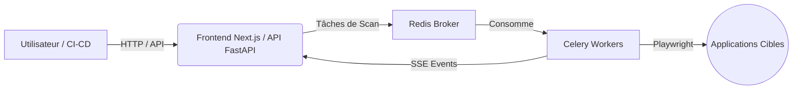

<div align="center">
  
  <h1>Sentinel DAST</h1>
  <p><strong>Plateforme DevSecOps de Tests de Sécurité Applicative Dynamique (DAST)</strong></p>
</div>

---

**Sentinel** est un scanner DAST d'entreprise conçu pour identifier automatiquement les vulnérabilités de sécurité dans vos applications web et API. Alliant une interface Next.js moderne à un moteur Python haute performance basé sur Playwright et Celery, Sentinel s'intègre parfaitement à vos processus d'intégration continue (CI/CD).

## ✨ Fonctionnalités Principales

*   📊 **Tableau de Bord Global (Analytics)** : Vue macro sur l'état de sécurité de toute votre infrastructure (Tendances, KPIs, Répartition des sévérités).
*   🚀 **Moteur de Scan Dynamique** : Basé sur Playwright pour exécuter le JavaScript et crawler les applications SPA/PWA complexes.
*   🔍 **Détection de Vulnérabilités** : XSS, SQLi, CSRF, SSRF, LFI, Open Redirects, Command Injection, Exposition de Secrets, Mauvaises configurations SSL/Headers, IDOR.
*   🛡️ **Gestion des Faux Positifs** : Mettez en sourdine les failles acceptées pour ne plus être alerté lors des prochains scans.
*   📄 **Rapports PDF Natifs** : Génération automatisée de rapports d'audit élégants au format PDF pour vos clients ou équipes.
*   🕒 **Scans Planifiés** : Automatisez vos audits de sécurité hebdomadaires via Celery Beat.
*   🔄 **Comparaison de Scans (History)** : Comparez deux audits pour détecter instantanément les failles résolues et les régressions.
*   🤖 **Intégration CI/CD** : Déclenchez des audits depuis GitHub Actions ou GitLab CI via l'API REST protégée par clé API.
*   🔑 **Authentification de bout en bout** : Scans authentifiés (injection de credentials via Playwright) pour analyser l'intérieur de votre application.

---

## 🏗️ Architecture du Projet

Sentinel repose sur une architecture microservices asynchrone pour garantir des performances optimales lors des scans longs :

*   **Frontend (Next.js 16 + TailwindCSS)** : Interface réactive, graphiques en temps réel via Server-Sent Events (SSE).
*   **Backend API (FastAPI)** : Gère les requêtes utilisateur, l'authentification et l'API CI/CD.
*   **Message Broker (Redis)** : File d'attente pour la communication asynchrone.
*   **Workers (Celery)** : Exécutent les scans Playwright en arrière-plan sans bloquer l'API.



---

## 📸 Aperçu de l'Interface

*(Note: Ajoutez vos propres captures d'écran dans un dossier `docs/` pour illustrer cette section)*

1.  **Global Analytics** : Vue d'ensemble des vulnérabilités.
    ``
2.  **Live Scan** : Progression du scan et logs en temps réel.
    ``
3.  **CI/CD Integration** : Scripts et documentation d'automatisation.
    ``

---

## 🚀 Installation & Démarrage Rapide

La méthode la plus simple pour déployer Sentinel est d'utiliser Docker.

### Prérequis
*   Docker & Docker Compose installés.
*   Git

### Déploiement Docker

1. **Cloner le repository**
   ```bash
   git clone https://github.com/xeanoob/sentinel.git
   cd sentinel
   ```

2. **Configurer les variables d'environnement (Optionnel)**
   Modifiez le fichier `backend/config.py` ou passez des variables d'environnement au conteneur pour changer la `SENTINEL_API_KEY` (utilisée pour l'accès CI/CD sans mot de passe).

3. **Lancer les conteneurs**
   ```bash
   docker-compose up --build -d
   ```

4. **Accéder à l'application**
   Ouvrez `http://localhost:3000` dans votre navigateur.
   Le mot de passe par défaut est la configuration cookie Master Password (ou modifiez le middleware Next.js selon vos besoins).

---

## 🛠️ Développement Local

Si vous souhaitez modifier le code de Sentinel :

### 1. Backend (FastAPI + Celery)
```bash
cd backend
python3 -m venv venv
source venv/bin/activate
pip install -r requirements.txt
playwright install chromium

# Lancer Redis en local (requis)
docker run -d -p 6379:6379 redis:alpine

# Lancer l'API FastAPI
python main.py

# (Dans un autre terminal) Lancer le worker Celery
celery -A worker.celery_app worker --loglevel=info
```

### 2. Frontend (Next.js)
```bash
cd ../ # Retour à la racine (src/)
npm install
npm run dev
```

---

## 🤖 Intégration CI/CD (GitHub Actions)

Sentinel est pensé pour s'intégrer dans vos pipelines. Voici un exemple pour lancer un scan automatiquement après chaque déploiement :

```yaml
name: DAST Security Scan
on:
  push:
    branches: [ "main" ]

jobs:
  security-scan:
    runs-on: ubuntu-latest
    steps:
      - name: Trigger Sentinel
        run: |
          curl -X POST https://votre-sentinel.com/api/v1/scans \
            -H "Content-Type: application/json" \
            -H "X-API-Key: ${{ secrets.SENTINEL_API_KEY }}" \
            -d '{
              "target_url": "https://staging.votre-app.com",
              "max_depth": 2
            }'
```

---

## 🛡️ Fonctionnalités du Moteur DAST (Modules)

Le dossier `backend/scanner/modules/` contient les scripts d'audit de sécurité. Les modules inclus sont :
*   `xss.py` : Injection de payloads XSS dans les formulaires et l'URL.
*   `sqli.py` : Détection de comportements anormaux suite à des apostrophes ou requêtes SQL.
*   `open_redirect.py` : Vérification des redirections non validées.
*   `secrets.py` : Recherche de tokens (AWS, JWT, API Keys) dans le DOM et le code source.
*   `ssl_check.py` : Analyse de la validité du certificat TLS/SSL.
*   `headers.py` : Vérification des headers de sécurité (HSTS, CSP, X-Frame-Options).
*   Et de nombreux autres (LFI, SSRF, CSRF, etc.) facilement extensibles.

**Créer un nouveau module :**
Il suffit de créer un nouveau fichier dans `modules/` héritant de `BaseModule` (voir `base.py`) et de surcharger la méthode `run_page()` ou `run_domain()`.

---

<div align="center">
  <i>Développé avec ❤️ pour sécuriser le web moderne.</i>
</div>
