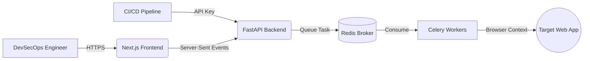

<br />
<div align="center">
  <a href="https://github.com/xeanoob/sentinel">
    
  </a>

  <h3 align="center">Sentinel DAST</h3>

  <p align="center">
    An Enterprise-Grade Dynamic Application Security Testing (DAST) Platform.
    <br />
    <a href="#about-the-project"><strong>Explore the docs »</strong></a>
    <br />
    <br />
    <a href="#usage">View Demo</a>
    ·
    <a href="https://github.com/xeanoob/sentinel/issues">Report Bug</a>
    ·
    <a href="https://github.com/xeanoob/sentinel/issues">Request Feature</a>
  </p>
</div>

<!-- BADGES -->
<div align="center">
  
  
  
  
  
</div>

<br />

<!-- TABLE OF CONTENTS -->
<details>
  <summary>Table of Contents</summary>
  <ol>
    <li>
      <a href="#about-the-project">About The Project</a>
      <ul>
        <li><a href="#built-with">Built With</a></li>
        <li><a href="#architecture">Architecture</a></li>
      </ul>
    </li>
    <li><a href="#key-features">Key Features</a></li>
    <li>
      <a href="#getting-started">Getting Started</a>
      <ul>
        <li><a href="#prerequisites">Prerequisites</a></li>
        <li><a href="#installation--deployment">Installation</a></li>
      </ul>
    </li>
    <li><a href="#usage">Usage & CI/CD</a></li>
    <li><a href="#extending-sentinel">Extending Sentinel</a></li>
    <li><a href="#license">License</a></li>
  </ol>
</details>

---

## About The Project

**Sentinel** is a modern, distributed Dynamic Application Security Testing (DAST) tool designed to fit seamlessly into DevSecOps environments. Unlike traditional scanners, Sentinel leverages a real browser engine to execute JavaScript and traverse complex Single Page Applications (SPAs) before analyzing network requests, DOM mutations, and server responses for critical security flaws.

Whether you are performing a one-off audit or integrating automated security checks into your GitHub Actions pipeline, Sentinel provides real-time streaming feedback and comprehensive vulnerability management.

### Built With

*   [![Next.js][Next.js]][Next-url]
*   [![Tailwind][Tailwind]][Tailwind-url]
*   [![FastAPI][FastAPI]][FastAPI-url]
*   [![Celery][Celery]][Celery-url]
*   [![Redis][Redis]][Redis-url]
*   [![Playwright][Playwright]][Playwright-url]

### Architecture

Sentinel relies on an asynchronous microservices architecture. Long-running scans are decoupled from the API using Redis and Celery, ensuring the Next.js dashboard remains perfectly responsive.



---

## Key Features

- **Advanced Crawler**: Context-aware crawling capable of handling complex authentication flows, JWTs, and session cookies.
- **Vulnerability Engine**: Detects OWASP Top 10 vulnerabilities including XSS, SQLi, SSRF, LFI, CSRF, IDOR, Open Redirects, and Secret Leakage.
- **Global Analytics**: A high-level DevSecOps dashboard tracking vulnerabilities across your entire infrastructure over time.
- **False Positive Management**: Mark findings as accepted risks. The engine will permanently mute them in all future scans.
- **Native PDF Export**: Generate beautiful, C-level executive PDF reports using headless Chromium.
- **Automated Scheduling**: Set up cron-based automated scans directly from the UI.
- **CI/CD Ready**: Trigger scans from GitHub Actions/GitLab CI with seamless API Key authentication and Webhook alerting.

---

## Getting Started

### Prerequisites

*   Docker Desktop (or Docker Engine + Docker Compose)
*   Git

### Installation & Deployment

Deploying Sentinel in your local environment or server is highly simplified via Docker.

1. **Clone the repository**
   ```sh
   git clone https://github.com/xeanoob/sentinel.git
   cd sentinel
   ```

2. **Configure Environment Variables**
   Sentinel uses default environment variables that work out of the box. For production, edit the variables in `docker-compose.yml` or your `.env` file to set your secure `SENTINEL_API_KEY`.

3. **Start the infrastructure**
   ```sh
   docker-compose up -d --build
   ```

4. **Access the Dashboard**
   Navigate to `http://localhost:3000` in your browser.

*(For local bare-metal development, refer to the frontend `package.json` and backend `requirements.txt`.)*

---

## Usage

### User Interface
Once logged into the dashboard, you can initiate a **Live Scan** by providing a target URL. The UI streams logs and findings in real-time via Server-Sent Events (SSE). 

You can also use the **History & Compare** tab to visualize the delta (introduced vs. resolved vulnerabilities) between any two historical scans.

### CI/CD Integration
Sentinel provides a robust REST API designed for headless execution. You can bypass cookie authentication using your Master API Key.

**Example: Triggering a scan via cURL**
```sh
curl -X POST http://sentinel.your-company.internal:8000/api/v1/scans \
  -H "Content-Type: application/json" \
  -H "X-API-Key: ci-cd-secret-key-change-me-in-prod" \
  -d '{
    "target_url": "https://staging.your-app.com",
    "max_depth": 3,
    "max_concurrency": 10,
    "webhook_url": "https://hooks.slack.com/services/T0000/B0000/XXXX"
  }'
```

---

## Extending Sentinel

Sentinel's modular architecture allows security engineers to write custom vulnerability signatures easily.

All active scanning modules reside in `backend/scanner/modules/`. To add a new vulnerability check:

1. Create a new python file (e.g., `my_custom_check.py`).
2. Inherit from `BaseModule`.
3. Implement `run_page(page, url, response)` for DOM/Response analysis, or `run_domain(domain)` for infrastructure checks.

```python
from modules.base import BaseModule
from models import Finding, Severity

class CustomHeaderModule(BaseModule):
    async def run_page(self, page, url: str, response) -> list[Finding]:
        findings = []
        headers = response.headers
        if "x-custom-security" not in headers:
            findings.append(Finding(
                url=url,
                vulnerability_type="Missing Custom Security Header",
                severity=Severity.LOW,
                description="The application does not enforce the custom security header.",
                recommendation="Add 'X-Custom-Security: enforce' to the server configuration."
            ))
        return findings
```

---

## License

Distributed under the MIT License. See `LICENSE` for more information.

---

<p align="center">
  <i>Engineered for modern web security.</i>
</p>

<!-- MARKDOWN LINKS & IMAGES -->
[Next.js]: https://img.shields.io/badge/next.js-000000?style=for-the-badge&logo=nextdotjs&logoColor=white
[Next-url]: https://nextjs.org/
[Tailwind]: https://img.shields.io/badge/Tailwind_CSS-38B2AC?style=for-the-badge&logo=tailwind-css&logoColor=white
[Tailwind-url]: https://tailwindcss.com
[FastAPI]: https://img.shields.io/badge/FastAPI-005571?style=for-the-badge&logo=fastapi
[FastAPI-url]: https://fastapi.tiangolo.com/
[Celery]: https://img.shields.io/badge/celery-%2337814A.svg?style=for-the-badge&logo=celery&logoColor=white
[Celery-url]: https://docs.celeryq.dev/
[Redis]: https://img.shields.io/badge/redis-%23DD0031.svg?style=for-the-badge&logo=redis&logoColor=white
[Redis-url]: https://redis.io/
[Playwright]: https://img.shields.io/badge/Playwright-2EAD33?style=for-the-badge&logo=playwright&logoColor=white
[Playwright-url]: https://playwright.dev/
